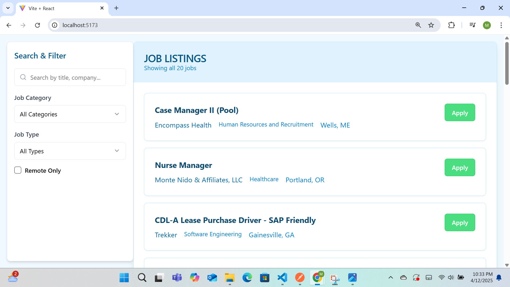

A responsive job board built with **React, Tailwind CSS, and shadcn/ui** for browsing, filtering, and adding job listings.

 

Features
**Browse Jobs** – Clean card layout with key details  
**Smart Filtering** – By category, job type, and remote status  
**Job Details Modal** – Click any job to view full description 

 Quick Start  

Clone & Install
   ```bash
   git clone https://github.com/yourusername/job-board.git
   cd jobListing
   npm install
